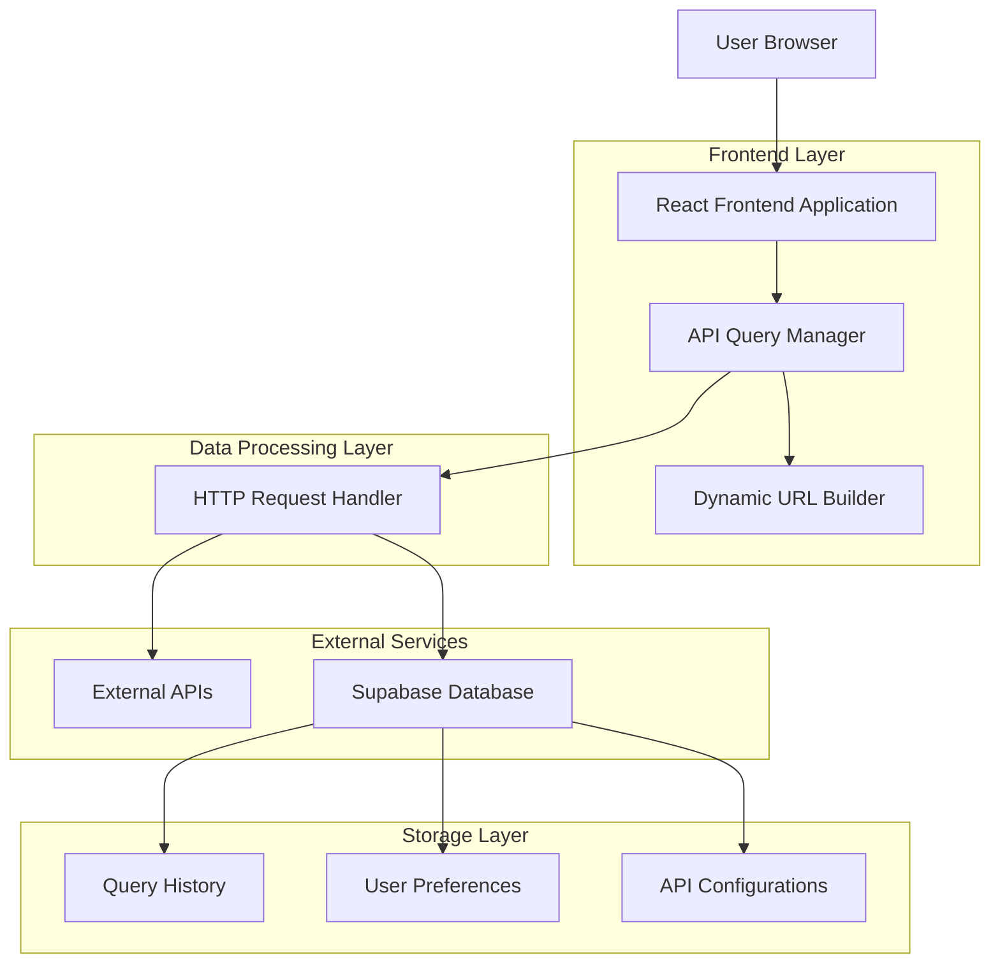
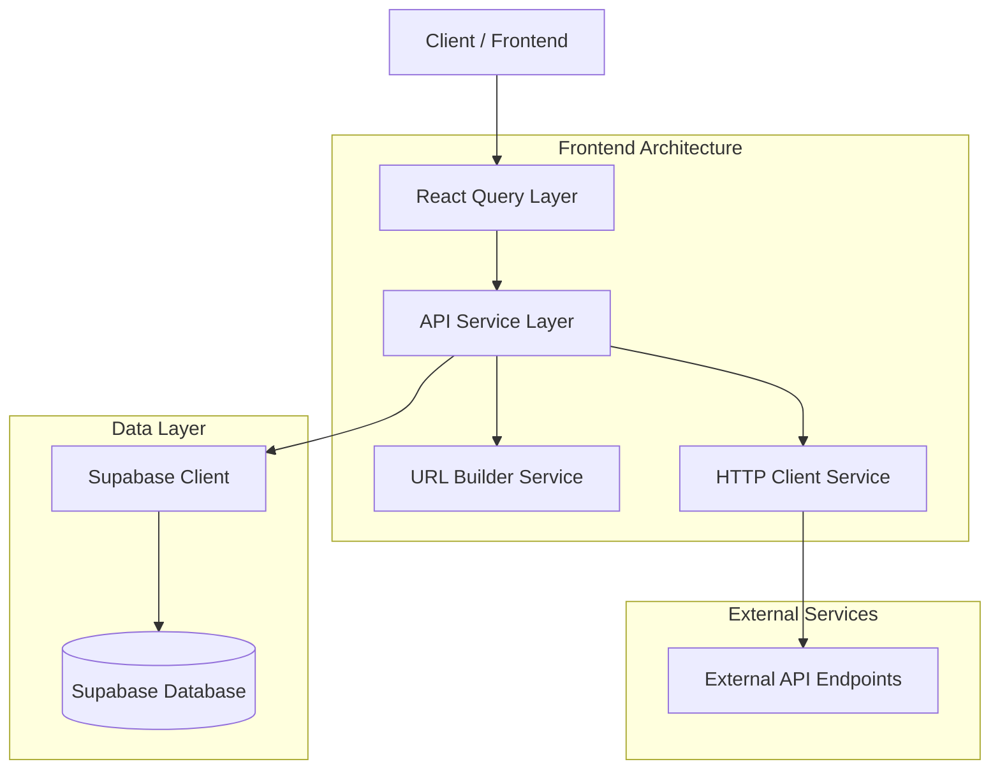
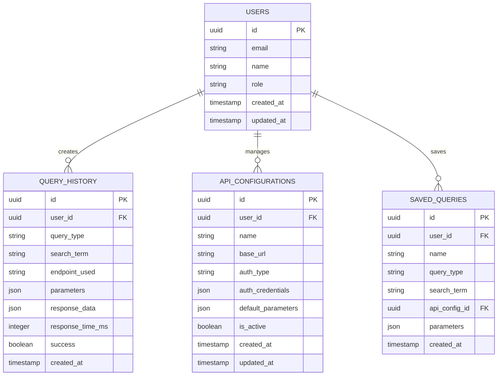

# Arquitetura Técnica - Painel de Consulta Dinâmica de API

## 1. Architecture design



## 2. Technology Description

- Frontend: React@18 + tailwindcss@3 + vite + axios@1.6
- Backend: Supabase (Authentication, Database, Real-time)
- State Management: React Context API + useReducer
- HTTP Client: Axios com interceptors para tratamento de erros
- UI Components: Componentes customizados baseados no design system Iara Games

## 3. Route definitions

| Route | Purpose |
|-------|---------|
| /painel | Página principal do painel de consultas com interface de busca |
| /painel/resultados | Exibição de resultados das consultas com filtros e paginação |
| /painel/configuracoes | Gerenciamento de endpoints de API e configurações de autenticação |
| /painel/historico | Visualização do histórico de consultas e consultas salvas |
| /painel/login | Autenticação de usuários para acesso ao painel |

## 4. API definitions

### 4.1 Core API

Consulta dinâmica de APIs externas
```
POST /api/query/execute
```

Request:
| Param Name | Param Type | isRequired | Description |
|------------|------------|------------|-------------|
| queryType | string | true | Tipo de consulta: 'game', 'user', 'forum' |
| searchTerm | string | true | Termo de busca fornecido pelo usuário |
| endpoint | string | true | URL base da API a ser consultada |
| parameters | object | false | Parâmetros adicionais para a consulta |

Response:
| Param Name | Param Type | Description |
|------------|------------|-------------|
| success | boolean | Status da operação |
| data | array/object | Dados retornados pela API externa |
| metadata | object | Informações sobre a consulta (tempo, total de resultados) |

Example Request:
```json
{
  "queryType": "game",
  "searchTerm": "Saci Pererê",
  "endpoint": "https://api.iaragames.com/jogos",
  "parameters": {
    "limit": 10,
    "category": "adventure"
  }
}
```

Gerenciamento de configurações de API
```
GET /api/config/endpoints
POST /api/config/endpoints
PUT /api/config/endpoints/{id}
DELETE /api/config/endpoints/{id}
```

Histórico de consultas
```
GET /api/history/queries
POST /api/history/queries/save
DELETE /api/history/queries/{id}
```

## 5. Server architecture diagram



## 6. Data model

### 6.1 Data model definition



### 6.2 Data Definition Language

Tabela de Usuários (users)
```sql
-- create table
CREATE TABLE users (
    id UUID PRIMARY KEY DEFAULT gen_random_uuid(),
    email VARCHAR(255) UNIQUE NOT NULL,
    name VARCHAR(100) NOT NULL,
    role VARCHAR(20) DEFAULT 'user' CHECK (role IN ('admin', 'advanced', 'user')),
    created_at TIMESTAMP WITH TIME ZONE DEFAULT NOW(),
    updated_at TIMESTAMP WITH TIME ZONE DEFAULT NOW()
);

-- RLS policies
ALTER TABLE users ENABLE ROW LEVEL SECURITY;
CREATE POLICY "Users can view own data" ON users FOR SELECT USING (auth.uid() = id);
CREATE POLICY "Users can update own data" ON users FOR UPDATE USING (auth.uid() = id);

-- Grant permissions
GRANT SELECT, UPDATE ON users TO authenticated;
GRANT SELECT ON users TO anon;
```

Tabela de Histórico de Consultas (query_history)
```sql
-- create table
CREATE TABLE query_history (
    id UUID PRIMARY KEY DEFAULT gen_random_uuid(),
    user_id UUID REFERENCES users(id) ON DELETE CASCADE,
    query_type VARCHAR(50) NOT NULL CHECK (query_type IN ('game', 'user', 'forum')),
    search_term VARCHAR(255) NOT NULL,
    endpoint_used VARCHAR(500) NOT NULL,
    parameters JSONB DEFAULT '{}',
    response_data JSONB,
    response_time_ms INTEGER,
    success BOOLEAN DEFAULT false,
    created_at TIMESTAMP WITH TIME ZONE DEFAULT NOW()
);

-- create indexes
CREATE INDEX idx_query_history_user_id ON query_history(user_id);
CREATE INDEX idx_query_history_created_at ON query_history(created_at DESC);
CREATE INDEX idx_query_history_query_type ON query_history(query_type);
CREATE INDEX idx_query_history_success ON query_history(success);

-- RLS policies
ALTER TABLE query_history ENABLE ROW LEVEL SECURITY;
CREATE POLICY "Users can view own query history" ON query_history FOR SELECT USING (auth.uid() = user_id);
CREATE POLICY "Users can insert own queries" ON query_history FOR INSERT WITH CHECK (auth.uid() = user_id);

-- Grant permissions
GRANT ALL PRIVILEGES ON query_history TO authenticated;
```

Tabela de Configurações de API (api_configurations)
```sql
-- create table
CREATE TABLE api_configurations (
    id UUID PRIMARY KEY DEFAULT gen_random_uuid(),
    user_id UUID REFERENCES users(id) ON DELETE CASCADE,
    name VARCHAR(100) NOT NULL,
    base_url VARCHAR(500) NOT NULL,
    auth_type VARCHAR(50) DEFAULT 'none' CHECK (auth_type IN ('none', 'bearer', 'api_key', 'basic')),
    auth_credentials JSONB DEFAULT '{}',
    default_parameters JSONB DEFAULT '{}',
    is_active BOOLEAN DEFAULT true,
    created_at TIMESTAMP WITH TIME ZONE DEFAULT NOW(),
    updated_at TIMESTAMP WITH TIME ZONE DEFAULT NOW()
);

-- create indexes
CREATE INDEX idx_api_configurations_user_id ON api_configurations(user_id);
CREATE INDEX idx_api_configurations_is_active ON api_configurations(is_active);

-- RLS policies
ALTER TABLE api_configurations ENABLE ROW LEVEL SECURITY;
CREATE POLICY "Users can manage own API configs" ON api_configurations FOR ALL USING (auth.uid() = user_id);

-- Grant permissions
GRANT ALL PRIVILEGES ON api_configurations TO authenticated;
```

Tabela de Consultas Salvas (saved_queries)
```sql
-- create table
CREATE TABLE saved_queries (
    id UUID PRIMARY KEY DEFAULT gen_random_uuid(),
    user_id UUID REFERENCES users(id) ON DELETE CASCADE,
    name VARCHAR(100) NOT NULL,
    query_type VARCHAR(50) NOT NULL CHECK (query_type IN ('game', 'user', 'forum')),
    search_term VARCHAR(255) NOT NULL,
    api_config_id UUID REFERENCES api_configurations(id) ON DELETE SET NULL,
    parameters JSONB DEFAULT '{}',
    created_at TIMESTAMP WITH TIME ZONE DEFAULT NOW()
);

-- create indexes
CREATE INDEX idx_saved_queries_user_id ON saved_queries(user_id);
CREATE INDEX idx_saved_queries_query_type ON saved_queries(query_type);

-- RLS policies
ALTER TABLE saved_queries ENABLE ROW LEVEL SECURITY;
CREATE POLICY "Users can manage own saved queries" ON saved_queries FOR ALL USING (auth.uid() = user_id);

-- Grant permissions
GRANT ALL PRIVILEGES ON saved_queries TO authenticated;

-- init data
INSERT INTO api_configurations (user_id, name, base_url, auth_type, default_parameters) VALUES
(gen_random_uuid(), 'Iara Games API', 'https://api.iaragames.com', 'bearer', '{"limit": 10}'),
(gen_random_uuid(), 'Forum API', 'https://forum.iaragames.com/api', 'api_key', '{"format": "json"}');
```