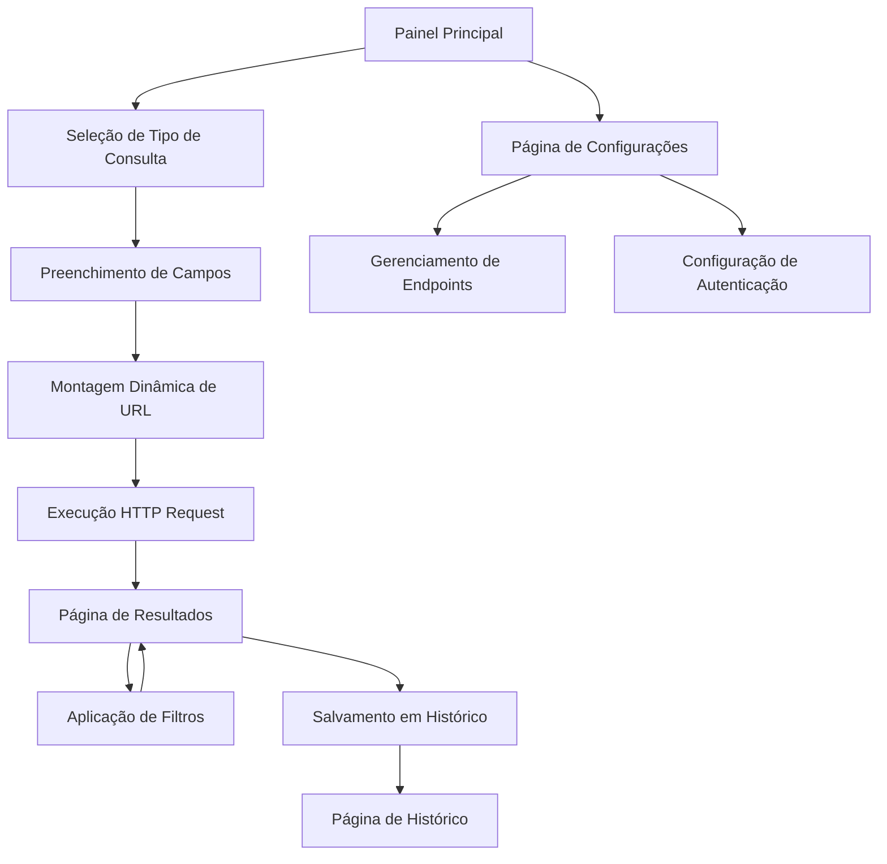

# Painel de Consulta Dinâmica de API - Iara Games

## 1. Product Overview

Sistema de painel interativo que permite aos usuários realizar consultas dinâmicas em APIs relacionadas ao ecossistema Iara Games, oferecendo busca em tempo real por jogos, usuários e conteúdo de fórum com interface visual consistente com o tema da plataforma.

O painel resolve a necessidade de acesso rápido e intuitivo a dados distribuídos em diferentes APIs, proporcionando uma experiência unificada para administradores e usuários avançados da plataforma Iara Games.

## 2. Core Features

### 2.1 User Roles

| Role | Registration Method | Core Permissions |
|------|---------------------|------------------|
| Administrador | Login com credenciais admin | Acesso completo a todas as consultas de API, visualização de dados sensíveis |
| Usuário Avançado | Upgrade via painel de controle | Consultas limitadas a dados públicos, sem acesso a informações privadas |
| Usuário Comum | Registro padrão | Apenas consultas básicas de jogos e fórum público |

### 2.2 Feature Module

Nosso painel de consulta dinâmica consiste nas seguintes páginas principais:

1. **Painel Principal**: interface de busca, seletor de tipo de consulta, campos de entrada dinâmicos
2. **Resultados**: área de exibição de dados, filtros de resultado, paginação
3. **Configurações**: gerenciamento de endpoints de API, configuração de autenticação
4. **Histórico**: log de consultas realizadas, consultas salvas, favoritos

### 2.3 Page Details

| Page Name | Module Name | Feature description |
|-----------|-------------|---------------------|
| Painel Principal | Interface de Busca | Campos de entrada dinâmicos baseados no tipo de consulta selecionado (nome do jogo, ID de usuário, título de fórum) |
| Painel Principal | Seletor de Tipo | Dropdown para escolher entre consultas de jogos, usuários ou fórum com atualização automática dos campos |
| Painel Principal | Construtor de URL | Montagem dinâmica da URL de consulta usando templates configuráveis |
| Resultados | Área de Exibição | Renderização de dados em formato cards, tabela ou lista com base no tipo de resultado |
| Resultados | Sistema de Filtros | Filtros contextuais baseados no tipo de dados retornados pela API |
| Resultados | Controle de Paginação | Navegação entre páginas de resultados com indicadores visuais |
| Configurações | Gerenciador de Endpoints | CRUD de endpoints de API com validação de conectividade |
| Configurações | Autenticação | Configuração de tokens e chaves de API com armazenamento seguro |
| Histórico | Log de Consultas | Registro cronológico de todas as consultas realizadas com detalhes |
| Histórico | Consultas Salvas | Sistema de favoritos para consultas frequentes com execução rápida |

## 3. Core Process

### Fluxo Principal do Usuário

1. **Acesso ao Painel**: Usuário acessa a interface principal e seleciona o tipo de consulta desejada
2. **Configuração da Busca**: Preenche os campos de entrada específicos (nome do jogo, ID de usuário, etc.)
3. **Execução da Consulta**: Sistema monta a URL dinamicamente e executa a requisição HTTP
4. **Visualização de Resultados**: Dados são exibidos em tempo real na interface com opções de formatação
5. **Ações Complementares**: Usuário pode filtrar, paginar, salvar ou exportar os resultados

### Fluxo de Administrador

1. **Configuração de Endpoints**: Acesso às configurações para gerenciar URLs de API
2. **Monitoramento**: Visualização de logs e estatísticas de uso do sistema
3. **Manutenção**: Atualização de credenciais e configurações de segurança

## 4. User Interface Design

### 4.1 Design Style

- **Cores Primárias**: #00030F (fundo escuro), #63C9BB (verde-água principal), #00ff88 (verde destaque)
- **Cores Secundárias**: #000000 (cards), rgba(99, 201, 187, 0.2) (hover states)
- **Estilo de Botões**: Bordas arredondadas (6px), gradientes sutis, efeitos hover com transição
- **Fontes**: Arial como principal, tamanhos 16px (corpo), 20px (subtítulos), 32px (títulos)
- **Layout**: Grid responsivo, cards com bordas em #63C9BB, espaçamento consistente de 20px
- **Ícones**: Estilo minimalista, cores consistentes com a paleta, uso de SVG para escalabilidade

### 4.2 Page Design Overview

| Page Name | Module Name | UI Elements |
|-----------|-------------|-------------|
| Painel Principal | Interface de Busca | Cards escuros com bordas #63C9BB, inputs com fundo transparente e bordas arredondadas, botão de busca com gradiente verde |
| Painel Principal | Seletor de Tipo | Dropdown customizado com estilo dark theme, ícones indicativos para cada tipo de consulta |
| Resultados | Área de Exibição | Layout em grid responsivo, cards com hover effects, loading states com animação |
| Resultados | Sistema de Filtros | Sidebar colapsível, checkboxes e sliders customizados, aplicação em tempo real |
| Configurações | Gerenciador de Endpoints | Tabela estilizada com ações inline, modais para edição, indicadores de status de conectividade |
| Histórico | Log de Consultas | Timeline vertical com timestamps, badges de status, busca rápida integrada |

### 4.3 Responsiveness

O painel é desenvolvido com abordagem mobile-first, garantindo adaptação completa para dispositivos móveis com otimização para touch interaction. Breakpoints principais em 768px (tablet) e 1024px (desktop) com reorganização inteligente dos elementos de interface.